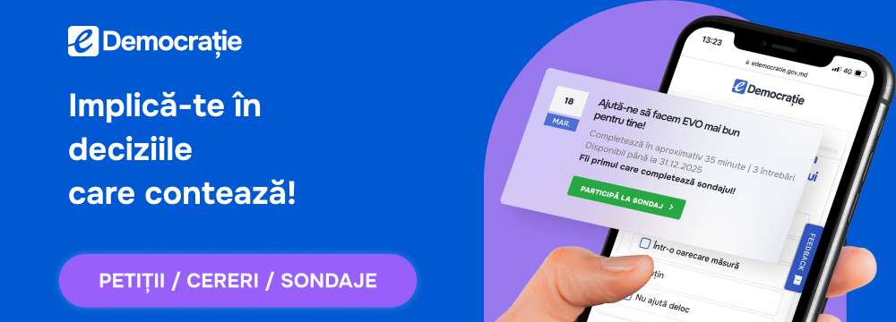

eDemocracy (ePetitions) is the platform that enables citizens and legal entities to submit petitions electronically to public authorities. The platform allows authorities to review, process, and respond to petitions through a centralized digital service.

The platform exposes a **REST API** that allows external information systems of public authorities to integrate with the service and manage petitions electronically.

API access is granted through one of the following authentication mechanisms:

- **X.509 system certificate** issued by **STISC** and registered in **MPass**
- **JWT token signed with RSA key**, validated using the public certificate registered

## At a glance

**What it is.** The platform through which natural persons and legal entities submit petitions, applications, opinions and feedback to public authorities electronically, and authorities register, examine and answer them in a single flow. An authority can integrate via API to pull requests and handle them in its own system, without double registration.
Terminology note: the system's Regulation uses the terms „registrator” (registrar) and „data provider” in senses that differ from the general legal framework — see the terminology section.

**Legal basis.** HG nr. 564/2024 cu privire la Sistemul informațional automatizat „e-Democrație” — pct. 2 — desemnarea posesorului și deținătorului.

Related acts: Legea nr. 239/2008 privind transparența în procesul decizional; Codul administrativ (petiționarea).

**Who is accountable.**

| Role | Entity |
|---|---|
| Holder (posesor) | AGE |
| Keeper (deținător) | AGE |
| Technical operator (operator tehnico-tehnologic) | De confirmat în textul HG nr. 564/2024 |

**Roles in an integration.**

• EGA (AGE) — holder/keeper of the platform; signs the integration agreement and registers the integrating system.
• STISC — issues the system certificate required for staging and production; operates the hosting infrastructure.
• Holder of the integrating system — decides the purpose and legal basis of use, the access rights, and is accountable for compliance.
• Development/integration team — implements and tests the technical integration.
• End user — the natural person or legal entity benefiting from the service.

**Access conditions.**

Gratuit. Accesul la API se acordă prin certificat de sistem X.509 emis de STISC și înregistrat în MPass, ori prin token JWT semnat cu cheie RSA, validat cu certificatul public înregistrat.

**Who this guide is for.**

Primary: development and integration teams of the holders of information systems, public and private.
Secondary: project managers and compliance officers preparing the agreement with EGA and the STISC certificate.

## Jump right in

  

    <a href="process/" class="quick-link-card">
      
⚡

      <h3 class="quick-link-title">Connection steps</h3>
      
Get started with integration

    </a>
    <a href="integration-development/" class="quick-link-card">
      
📘

      <h3 class="quick-link-title">Integration guide</h3>
      
Step-by-step documentation

    </a>
    <a href="api-reference/" class="quick-link-card">
      
🌐

      <h3 class="quick-link-title">API reference</h3>
      
Explore endpoints and callbacks

    </a>    
  

