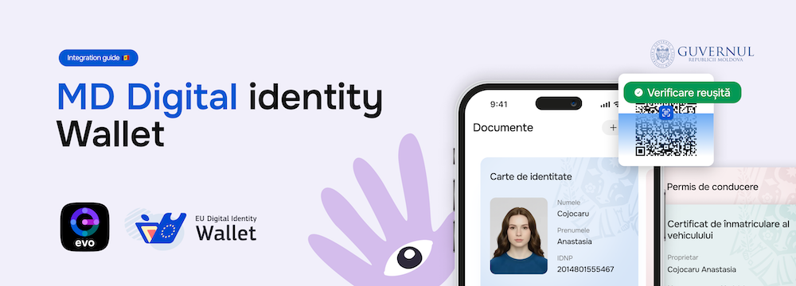

Following the EUDI Wallet regulation and its implementing acts, EVO Wallet implements remote presentation of attributes to wallet-relying parties according to **OpenID4VP 1.0**, using the mdoc format defined in **ISO/IEC 18013-5**, via same-device flow to retrieve documents. The mechanism is described in Section 8.3.1 of OpenID4VP 1.0 as **direct_post.jwt** response mode. Actual implementation profile is guided by **OpenID4VC HAIP 1.0** with ISO mdoc as credential format.

OpenID4VP is an extension of OAuth 2.0 that enables the Holder (mdoc holder) to present Credential (mdoc) using its Wallet (mdoc app) to a Verifier (mdoc reader) upon request. In this context, the Wallet acts as OAuth 2.0 Authorization Server and the Verifier acts as OAuth 2.0 Client.

  <a href="https://forms.office.com/pages/responsepage.aspx?id=Z4f8jWsRaEKDxfvIWTRtONCmd0F9yDZKhSOtD6Jvt2xUMTVKOEE2NlRKNkQ0SlJZRkNQWDVISzE3UiQlQCN0PWcu&route=shorturl" target="_blank" style="display:inline-block; background-color:#1a6df0; color:#ffffff; font-size:16px; font-weight:600; padding:14px 28px; border-radius:8px; text-decoration:none; font-family:-apple-system,BlinkMacSystemFont,'Segoe UI',Roboto,sans-serif;">
    Become a Verifier in the EVO Wallet Ecosystem&nbsp;&nbsp;↗
  </a>

## Jump right in

  

    <a href="integration/" class="quick-link-card">
      
🔌

      <h3 class="quick-link-title">Integration</h3>
      
How to integrate with EVO Wallet

    </a>
    <a href="protocol/" class="quick-link-card">
      
🔐

      <h3 class="quick-link-title">Protocol</h3>
      
OpenID4VP flow

    </a>
    <a href="examples/" class="quick-link-card">
      
🧾

      <h3 class="quick-link-title">Examples</h3>
      
Full request/ response payload samples

    </a>
    <a href="demoverifierbnm/" class="quick-link-card">
      
🏦

      <h3 class="quick-link-title">Demo verifier</h3>
      
Provided by the National Bank of Moldova

    </a>
  

## Relying Parties in Production

  

    Live
    Relying parties that have completed onboarding and accept EVO Wallet presentations in production.
  

  

    

      
        
      
      
Moldindconbank

    

    

      
        
      
      
FinComBank

    

  

## Referenced standards

| Standard | Description |
|----------|-------------|
| OpenID4VP 1.0 | OpenID for Verifiable Presentations 1.0 |
| OpenID4VC HAIP 1.0 | OpenID for Verifiable Credentials High Assurance Interoperability Profile 1.0 |
| RFC 6749 | The OAuth 2.0 Authorization Framework |
| RFC 8414 | OAuth 2.0 Authorization Server Metadata |
| RFC 9101 | The OAuth 2.0 Authorization Framework: JWT-Secured Authorization Request (JAR) |
| ISO/IEC 18013-5:2021 | Personal identification — ISO-compliant driving licence Part 5: Mobile driving licence (mDL) application |
| ISO/IEC TS 18013-7:2025 | Personal identification — ISO-compliant driving licence Part 7: Mobile driving licence (mDL) add-on functions |
| RFC 7049 | Concise Binary Object Representation (CBOR) |
| RFC 8152 | CBOR Object Signing and Encryption (COSE) |
| RFC 8610 | Concise Data Definition Language (CDDL): A Notational Convention to Express Concise Binary Object Representation (CBOR) and JSON Data Structures |
| RFC 9360 | CBOR Object Signing and Encryption (COSE): Header Parameters for Carrying and Referencing X.509 Certificates |
| IETF TSL _draft_ | IETF Token Status List - _draft-ietf-oauth-status-list-21_ |

