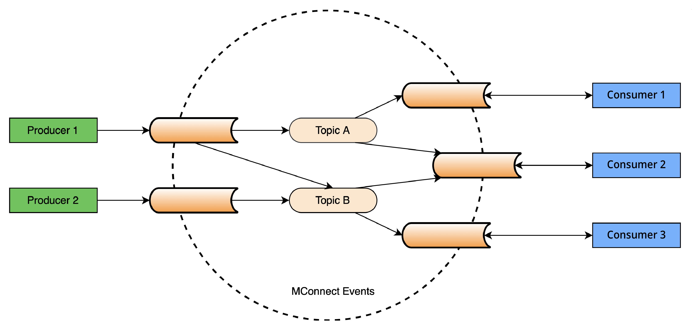

Data exchange in any Government is a complex endeavor across various levels of effort, including legal, semantic, organizational and technical. In Moldova, the technical level of data exchange is facilitated by MConnect – a national data exchange platform. There are many well-known patterns to implement various data exchange scenarios, including classical request/response messaging, events distribution, large documents distribution and data streaming.

## At a glance

**What it is.** The component of the MConnect platform dedicated to event-based data exchange. Instead of a system polling the source with „has anything changed?”, the source publishes an event when the change occurs and authorised systems receive it in near real time. It lowers the coupling between systems: the producer need not know who consumes, and the consumer can take events at its own pace.

MConnect Events has no separate legal act: it is regulated as a component of the MConnect platform.

**Legal basis.** HG nr. 211/2019 privind platforma de interoperabilitate (MConnect) — aplicabilă ca parte componentă — pct. 3 — desemnarea posesorului și deținătorului platformei MConnect.

Related acts: Legea nr. 142/2018 cu privire la schimbul de date și interoperabilitate.

**Who is accountable.**

| Role | Entity |
|---|---|
| Holder (posesor) | AGE (prin MConnect) |
| Keeper (deținător) | AGE (prin MConnect) |
| Technical operator (operator tehnico-tehnologic) | De confirmat în textul HG nr. 211/2019 |

**Roles in an integration.**

• EGA (AGE) — holder/keeper of the platform; signs the integration agreement and registers the integrating system.
• STISC — issues the system certificate required for staging and production; operates the hosting infrastructure.
• Holder of the integrating system — decides the purpose and legal basis of use, the access rights, and is accountable for compliance.
• Development/integration team — implements and tests the technical integration.
• End user — the natural person or legal entity benefiting from the service.

**Access conditions.**

Aceleași condiții ca MConnect. Obligatoriu: certificat de client X.509 v3, autorizare distinctă ca producător și/sau consumator, pe fiecare tip de eveniment.

**Who this guide is for.**

Primary: development and integration teams of the holders of information systems, public and private.
Secondary: project managers and compliance officers preparing the agreement with EGA and the STISC certificate.

As part of MConnect platform, MConnect Events is the component designed specifically for efficient production and consumption of events. This includes client authentication and authorization as producers and consumers, scalable production and consumption of events, event structure validation when produced, scalable and flexible storage of events awaiting consumption, immediate availability of events to consumers, confirmation of event consumption to ensure reliable delivery of events, as well as internal instruments for configuration, monitoring and troubleshooting.

<picture class="theme-picture">
  
</picture>

MConnect Events enables systems to exchange data about various events in real-time as well as in
a disconnected way. Events are flowing from producers to MConnect Events then to consumers in
their supported pace, whenever they are available. This lowers the coupling between producers and
consumers, decreasing their availability and performance requirements.

This document describes the technical interfaces exposed by MConnect Events for client
information systems enabling them to produce and consume events. Its target audience is the
development teams for those information systems.

The document contains the relevant information required for a complete understanding of MConnect
Events from the integration point of view. It contains integration-related technical details, security
considerations, as well as describing the integration testing.

Although the document is meant to be technology agnostic, it is also documenting the integration
library built for .NET to simplify and speed-up integrations with .NET clients.

## Scope and target audience
This document describes the technical interfaces exposed by MConnect Events for client
information systems that are using it to produce and consume events. Its target audience is the
development teams for those information systems.

## Glossary of terms

For the complete glossary, please visit the [Glossary page](https://egov-moldova.github.io/egov4dev/glossary/glossary/).

## General system capabilities

MConnect Events is a platform-level service, a component of MConnect, the National
Interoperability Platform, that allows information systems to efficiently produce and consume events
in near real-time.

Our performance tests showed a steady throughput of 10K events/second involving several
producers and consumers in parallel. You can produce and consume events from multiple instances
of your app using the same client certificate. Additionally, a consumer can repeatedly consume the
available events by specifying a different consumer group (instead of using the default one).

MConnect Events authorizes producers and routes events according to each event type. It is possible
to authorize multiple producers to produce events of the same event type and configure routing to
enable multiple consumers to consume events of the same type. Producer authorization also
includes validating each event structure using JSON schema defined for each event type.

Producers can produce a single event or a batch of events. It is important to mention that if one event
is wrong, e.g. having unauthorized event type for this producer or invalid structure according to the
configured schema, the whole batch is rejected.

In cases that require ordered consumption of events related to a particular real-life entity (such as a
person, transaction, etc.), producers must specify a partition key according to CloudEvents
partitioning extension.

By default, MConnect Events stores produced events for up to 5 days (120 hours) enabling
consumers to consume whenever they are available. To ensure high availability, events are stored in
3 replicas. These settings can be changed upon request when reasonable.

To simplify consumer integration testing, the API allows consumers to produce test events for their
own consumption.

Consumers can report back events they are unable to consume (usually due to wrong structure) as
dead events. They are stored in a special dead event storage for the consumer and might require
further manual intervention.

## Service dependencies
MConnect Events is deployed in a highly available infrastructure and depends only on the availability
of MPass API for client management. MPass API is also highly available, however, MConnect Events
caches client settings for up to 30 minutes. This ensures high performance of connection opening
except for the initial ones, thus decreasing this dependency.

It is also important to note that, due to implementation technicalities, it is normal for consumers to
start consuming events with a short delay (several seconds) after opening the consumer connection.

## Protocols and standards

MConnect Events exposes its APIs over HTTPS, supporting HTTP 1.1 and 2. The HTTPS endpoint uses
TLS 1.2 and higher and requires authentication through client certificates (encoded in X.509 v3
format).

MConnect Events clients use [CloudEvents v1](https://cloudevents.io) to produce and consume events using JSON Event
Format and HTTP Protocol Binding. Whenever required, producers can specify a partition key, as
documented in [CloudEvents partitioning extension](https://github.com/cloudevents/spec/blob/v1.0.2/cloudevents/extensions/partitioning.md), while consumers shall use WebSocket Protocol Binding for efficient consumption of events.

The endpoints for producers and long-polling consumers are described in [OpenAPI 3.0](https://www.openapis.org/) format.
However, for efficient consumers, the recommendation is to use the WebSocket endpoint, which is
accessible via the standard [HTTP 1.1 Protocol upgrade mechanism](https://http.dev/protocol-upgrade), or the standard HTTP 2
CONNECT method ([see 8.3 in RFC 7540](https://httpwg.org/specs/rfc7540.html)).

When validating events during production against the configured schema the supported versions of JSON Schema are Draft 6, Draft 7, Draft 2019-09 and [Draft 2020-12](https://json-schema.org/specification). The version is identified based
on keywords used by the schema.

## Limits

According to CloudEvents standard, it is recommended that the published events be no larger than [**64 KB**](https://github.com/cloudevents/spec/blob/v1.0.2/cloudevents/spec.md#size-limits). This not only ensures any intermediaries will forward the events but also makes the transmission of events efficient and allows broader distribution of events, while stressing the core meaning of events (i.e. messages that inform about something that happened and not a transport for any kind of data). CloudEvents producers SHOULD keep events compact by avoiding embedding large data items into event payloads and rather use the event payload to link to such data items.

All HTTP requests sent to MConnect Events can have up to **1 MB** in size. This means any HTTP message sent by the producer, an events batch or one single event, shall not be larger than 1 MB.

By default, MConnect Events keeps unconsumed events up to **5 days (120 hours)**. This means that if a consumer is inactive for that time, it might miss events.

By default, MConnect Events consumers in a group can be efficiently scaled in **divisors of 12**, e.g. 1, 2, 3, 4, 6 or 12 consumers.

Should any of these limits not cover your practical scenarios, you can request their adjustments having a **proper justification**.
