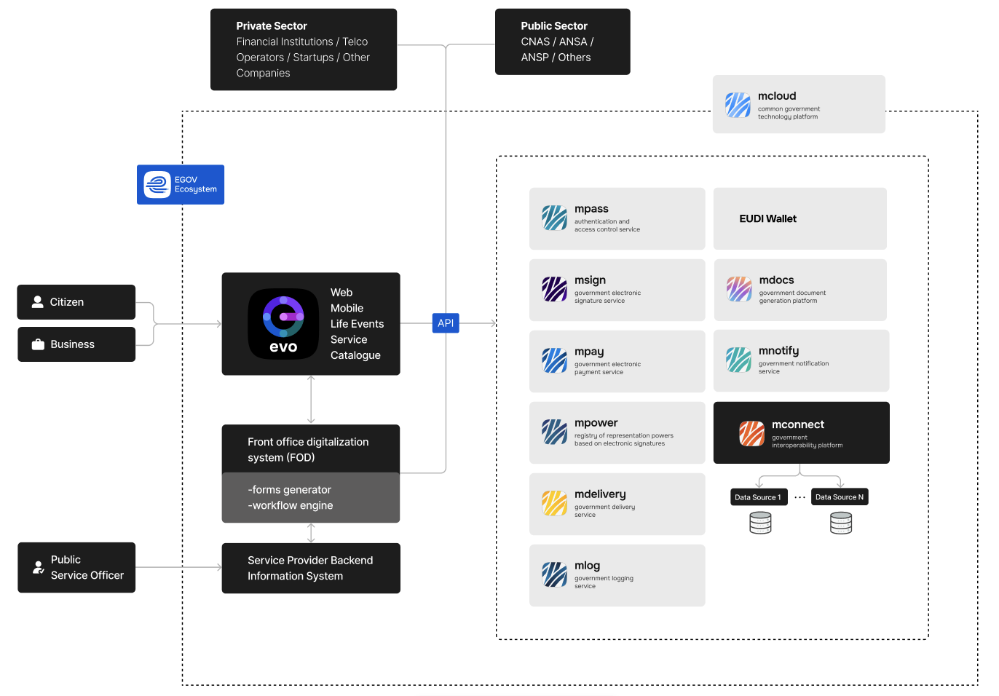

Moldovan eGovernment Agency (MEGA) ecosystem is composed of a series of interconnected platforms and services, each with a specific role in the digital transformation of public services. Together, they create a secure, efficient, and citizen-centric digital environment.

## **MConnect** – interoperability platform

 MConnect is the state interoperability platform that enables the exchange of data between information systems of public authorities and institutions. Through this platform, citizens and businesses are no longer required to present certificates, extracts, copies, or other documents that are already available in electronic format within governmental systems.  

The use of MConnect ensures access to authentic data directly from the original sources, reduces administrative burden, eliminates duplication of information, and contributes to increased efficiency in the interaction between citizens, businesses, and the state.  

The platform is based on the principles of legality, equal access, authenticity, and shared responsibility of data providers and consumers. Institutions connected to MConnect provide services to other entities through secure communication channels, according to established agreements and legal provisions.  

Today, more than 480 institutions are connected to MConnect, ensuring millions of automated data exchanges every day. This makes MConnect a fundamental component of the national e-Government infrastructure, contributing directly to the digital transformation of public administration.  

---

## **MPass** – authentication and authorization service

 MPass is the government authentication and authorization service that provides citizens and officials with secure access to electronic public services. By using MPass, users authenticate only once and then access multiple platforms and systems without the need for repeated logins.  

Authentication through MPass can be performed using various methods, such as mobile signature, cryptographic token, or the EVOSign application. The system complies with international security standards, ensuring the confidentiality and integrity of the authentication process.  

Currently, MPass is integrated with more than 190 government platforms and systems, offering citizens a convenient and secure way to access e-services.  

---

## **MSign** – electronic signature service

 MSign is the electronic signature service of the Republic of Moldova, designed to provide authenticity and legal validity to electronic documents. The service allows both public institutions and private entities to sign documents digitally, eliminating the need for paper-based processes.  

Through MSign, citizens and organizations can sign contracts, requests, certificates, and other official documents using qualified certificates issued by accredited providers. The signed documents ensure integrity, authenticity, and non-repudiation, in accordance with the law.  

The platform contributes to reducing bureaucracy, saving time, and ensuring a higher level of security in communication between the state, businesses, and citizens.  

---

## **MPower** – delegation service

 MPower is the digital delegation service that enables citizens and organizations to grant representation rights to other individuals or entities for accessing electronic public services.  

Through MPower, a parent can delegate authority to access services on behalf of their child, an employer can delegate tasks to employees, and lawyers can represent clients. The system is integrated with MPass, MSign, MConnect, and MNotify, ensuring secure and verifiable delegation processes.  

This service brings significant benefits in terms of flexibility, reducing the need for physical presence, and offering trusted mechanisms for legal digital representation.  

---

## **MNotify** – notification service

 MNotify is the platform for electronic notifications that allows public institutions to send official notifications to citizens and businesses via multiple channels, such as email, SMS, mobile applications, or the MCabinet portal.  

Notifications sent through MNotify keep citizens informed about fines, payments, deadlines, allowances, and other obligations or rights. The system improves communication between the government and citizens, ensuring transparency and efficiency.  

MNotify can send both automatic and manual notifications, offering flexibility to institutions and convenience to recipients.  

---

## **MDelivery** – document delivery service

 MDelivery is the government service that ensures the delivery of official documents directly to citizens at their place of residence or work, without the need to visit public institutions.  

Launched in July 2022, MDelivery allows citizens to receive documents such as criminal record certificates, civil status certificates, or apostilled documents through integrated postal service providers.  

The platform reduces administrative costs, increases accessibility, and provides a modern way for the government to deliver official documents both within Moldova and abroad.  

---

## **MLog** – logging service

 MLog is the centralized logging service for public sector information systems, ensuring transparency, traceability, and accountability. The platform records essential data about user actions, including identifiers, timestamps, accessed resources, and operation results.  

The service is mandatory for all systems that process personal data and critical government information, as established by Government Decision no. 708/2014.  

MLog provides authorities with the necessary tools to audit activity, detect anomalies, and prevent unauthorized access or misuse of information systems.  

---

## **MDocs** – document management platform

 MDocs is the government platform for the storage and exchange of documents in digital format. It allows public institutions to upload, share, and access documents securely, while citizens can retrieve their documents directly via MCabinet.  

The platform reduces paper usage, simplifies administrative processes, and ensures compliance with transparency and security standards.  

MDocs is an essential component of Moldova’s digital government ecosystem, contributing to the efficiency of public administration and the convenience of interactions between citizens, businesses, and the state.
