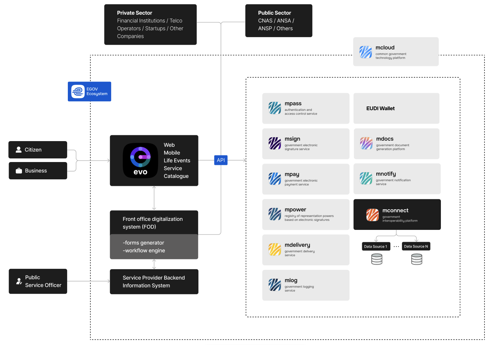

This section is a technical orientation for developers new to the **eGov Moldova** ecosystem. This page summarizes how the ecosystem is organized, which technical interfaces each platform exposes, the technology stack used to build government digital services, and the practices that apply when developing or integrating them.

The rest of the section goes deeper into the engineering standards that apply to teams building solutions for the ecosystem:

- **[API design guide](api-design-guide.md)** – how to design consistent REST APIs for government information systems
- **[Code standards](code-standards.md)** – coding, security, testing, and UI standards for development teams
- **[Code reviews](code-reviews.md)** – branching model, pull request rules, and review etiquette
- **[Architecture decision records](adr.md)** – how architectural decisions are documented
- **[Log management](log-management.md)** – audit and technical logging requirements

It complements the more detailed pages of this documentation: [Platforms and services](../platforms/index.md) (the business view), [Development principles](../principles/architecture.md) (the architecture rules), and [Tools and technologies](../tools/technologies.md) (the full stack reference).

* * *

## Ecosystem at a glance

Moldova's digital government is built as a set of **reusable, shared platform services** operated by the Moldova eGovernance Agency. Instead of each institution building its own authentication, payments, signing, or notification capability, information systems integrate the shared platforms and focus on their own business logic — in line with the [reuse](../principles/architecture.md#reuse-of-solutions) and [interoperability](../principles/architecture.md#interoperability-in-mind) principles.

All platforms are hosted on **[MCloud](https://www.egov.md/en/content/mcloud-platform)**, the government cloud operated by [STISC](https://stisc.gov.md/), and exchange data through **MConnect**, the national interoperability platform.

| Layer | Platforms | What it provides |
| --- | --- | --- |
| Identity and trust | [MPass](../guides/mpass/index.md), [MSign](../guides/msign/index.md), [MPower](../guides/mpower/index.md), [EVO Wallet](../guides/evo-wallet/index.md) | Single Sign-On and Single Logout, qualified electronic signature, delegation of representation rights, EUDI-compatible digital identity wallet |
| Data exchange | MConnect ([MConnect Events](../guides/mconnect-events/index.md)), [Semantic Catalog](http://semantic.gov.md/) | Authentic data directly from source registers, near real-time event distribution, single point of discovery for government data |
| Service enablers | [MPay](../guides/mpay/index.md), [MNotify](../guides/mnotify/index.md), [MDelivery](../guides/mdelivery/index.md), [MDocs](../guides/mdocs/index.md) | Payments with any market instrument, multi-channel notifications, physical delivery of official documents, storage and exchange of digital documents |
| Transparency and audit | [MLog](../guides/mlog/index.md) | Centralized registration of legal events, mandatory for systems processing personal and critical data |
| Citizen participation | [eDemocracy (ePetitions)](../guides/e-democracy/index.md) | Electronic submission and processing of petitions |

* * *

## Integration interfaces

Each platform exposes a documented technical interface. The table below is the quickest way to see what kind of integration to expect before opening the corresponding guide.

| Platform | Scope | Technical interface |
| --- | --- | --- |
| MPass | Authentication and authorization (SSO/SLO) | SAML 2.0 |
| MSign | Electronic signature | SOAP |
| MPay | Payments for public services | SOAP with signed messages |
| MPower | Delegation of representation rights | REST |
| MConnect Events | Event production and consumption | REST |
| MNotify | Notifications (e-mail, push, Viber, Telegram, MCabinet) | REST |
| MDelivery | Delivery of official documents | SOAP and REST |
| MDocs | Document storage and exchange | REST |
| MLog | Legal event logging | REST |
| EVO Wallet | Remote presentation of identity attributes | OpenID4VP 1.0 (OAuth 2.0), ISO/IEC 18013-5 mdoc |
| eDemocracy | Electronic petitions | REST |

REST services publish machine-readable **OpenAPI** contracts — the exact locations are listed in each guide's API reference. SOAP services publish **WSDL** contracts and require message-level signatures with the service certificate.

* * *

## Technology

The stack below is the reference stack used by the eGovernance Agency to build the platforms and recommended for government information systems. See [Tools and technologies](../tools/technologies.md) for the complete list.

### General

| Technology | Description |
| --- | --- |
| C# / .NET | The primary development platform for government digital services. A single language across backend and frontend enables shared code, shared tooling, and reusable integration libraries distributed as NuGet packages. |
| ASP.NET Core | The web framework used for REST services and scalable web applications. |

### Frontend

| Technology | Description |
| --- | --- |
| Blazor (Server / WebAssembly) | Framework for building interactive web interfaces in .NET, keeping one language across the whole solution. |
| Fod.UIComponents | The Agency's own Blazor UI component library and the target component standard for new interfaces, aligned with the unified design system. |
| MudBlazor | Component library used by existing applications — the ecosystem is transitioning from MudBlazor to Fod.UIComponents. |
| MUD — Unified design system | The [Moldovan Statewide Design System](../mud/index.md) — mandatory for all public institutions and their suppliers. Standardizes components, color palettes, typography, spacing, and interaction patterns with accessibility built in. |

### Backend

| Technology | Description |
| --- | --- |
| Entity Framework Core | Object-relational mapper for access to relational databases. |
| FluentValidation | Declarative validation of requests and business rules. |
| Swashbuckle (OpenAPI) | Generates Swagger documentation directly from the service code, keeping API contracts and implementation in sync. |

### Data

| Technology | Description |
| --- | --- |
| SQL Server / PostgreSQL | Relational storage for transactional data. |
| Redis | Distributed caching and performance optimization. |
| JSON structures | Dynamic configuration of rules, categories, and validations without redeployment. |

### Protocols and specifications

| Protocol | Where it is used |
| --- | --- |
| SAML 2.0 | Authentication and identity attributes exchange with MPass. |
| SOAP | Signature, payment, and delivery operations (MSign, MPay, MDelivery), with certificate-based message signing. |
| REST + OpenAPI | Modern service interfaces (MPower, MConnect Events, MNotify, MDocs, MLog, eDemocracy). |
| OAuth 2.0 / OpenID4VP 1.0 | Presentation of wallet credentials to relying parties (EVO Wallet), with documents in ISO/IEC 18013-5 mdoc format per the EUDI Wallet regulation. |
| TLS with client certificates | Transport security and client authentication across platforms, using certificates issued by [STISC](https://semnatura.md/). |

### Integration libraries

Official integration libraries are published to [NuGet](https://www.nuget.org/profiles/egov-moldova) for systems built on ASP.NET Core, for example:

| Package | Purpose |
| --- | --- |
| `Egov.Integrations.MPass.Saml` | Service Provider integration with MPass using SAML 2.0. |
| `Egov.Integrations.MSign.Soap` | Integration with MSign for digital signature operations over SOAP. |
| `Egov.Extensions.Configuration` | Certificate loading and configuration helpers shared by the Egov packages. |

Systems built on other stacks integrate through the open protocols directly — the guides include samples in other languages (for example, Java samples for MLog). See the *Integration libraries* section of each guide.

### Code storage and collaboration

| Tool | Description |
| --- | --- |
| Azure DevOps | Work management (deliveries, tasks, bugs) and automated build, test, and deploy pipelines. |
| GitLab | Version control and continuous integration. |
| Private NuGet feeds | Distribution of reusable internal components across teams. |
| GitHub ([egov-moldova](https://github.com/egov-moldova)) | Public home of this documentation and of open integration libraries and samples. |

### Infrastructure

| Technology | Description |
| --- | --- |
| MCloud | The government cloud platform hosting the services, with configurations for scalability, security, and disaster recovery. |
| Docker | Packaging of applications into portable containers. |
| Kubernetes | Orchestration of containerized services. |
| Helm | Declarative, versioned deployments to Kubernetes with fast rollback. |

### Monitoring and observability

| Tool | Description |
| --- | --- |
| Elasticsearch + Kibana | Indexing, searching, and visualizing logs and operational data. |
| Prometheus + Grafana | Metrics collection, monitoring, and dashboards. |
| MLog | Registration of legally significant events, complementing technical logging with an audit trail required by regulation. |

### Documentation

| Resource | Description |
| --- | --- |
| eGov4Dev | This site — the official developer documentation, built with MkDocs and published from the [egov4dev](https://github.com/egov-moldova/egov4dev) repository. |
| OpenAPI contracts | Machine-readable API contracts published by the REST services; locations are listed in each integration guide's API reference. |

* * *

## Environments

Every platform is available in two environments, following a consistent URL convention:

| Environment | URL pattern | Purpose |
| --- | --- | --- |
| Staging | `https://<service>.staging.egov.md` | Integration development and testing. |
| Production | `https://<service>.gov.md` | Live operation, after successful integration testing. |

Access to both environments requires registration of the integrating system and, for most platforms, a client certificate issued by STISC used for TLS authentication and — for SOAP services — message signing. The exact steps, contacts, and contractual requirements are described in the [Connection procedure](../platforms/procedure.md).

* * *

## Practices

**Architecture.** All solutions must follow the [Development principles](../principles/architecture.md): interoperability by default, security and privacy by design, reuse of shared platforms, the once-only principle, and event-driven integration ("events by default"). Data is consumed from authentic registers through MConnect rather than collected repeatedly from citizens.

**Integration lifecycle.** Integrations start in staging, follow the steps in the [Connection procedure](../platforms/procedure.md), and move to production only after integration testing. Platforms with legal or financial impact (for example MPass, MPay, MSign) additionally require contracts per the applicable regulatory framework — see [access and pricing](../platforms/index.md#access-and-pricing).

**Engineering standards.** Teams building solutions for the ecosystem follow the standards in this section: the [API design guide](api-design-guide.md) for new service interfaces, the [code standards](code-standards.md) and [code review rules](code-reviews.md) for day-to-day development, [architecture decision records](adr.md) for significant technical choices, and the [log management](log-management.md) requirements for auditability.

**Consistent guides.** Every integration guide in this documentation follows the same skeleton — overview, connection steps, interaction scenarios, integration development, API reference, examples, integration libraries, and change log — so once you have integrated one platform, the next one will feel familiar.

* * *

## Where to go next

- [Platforms and services](../platforms/index.md) — what each platform does and on what terms it is available
- [Connection procedure](../platforms/procedure.md) — how to get connected to a service
- [Development principles](../principles/architecture.md) — the mandatory architecture principles
- [Tools and technologies](../tools/technologies.md) — the full technology reference
- [Unified design system](../mud/index.md) — the national design standard for government interfaces
- **Integration guides** — the step-by-step guide for the platform you are integrating
